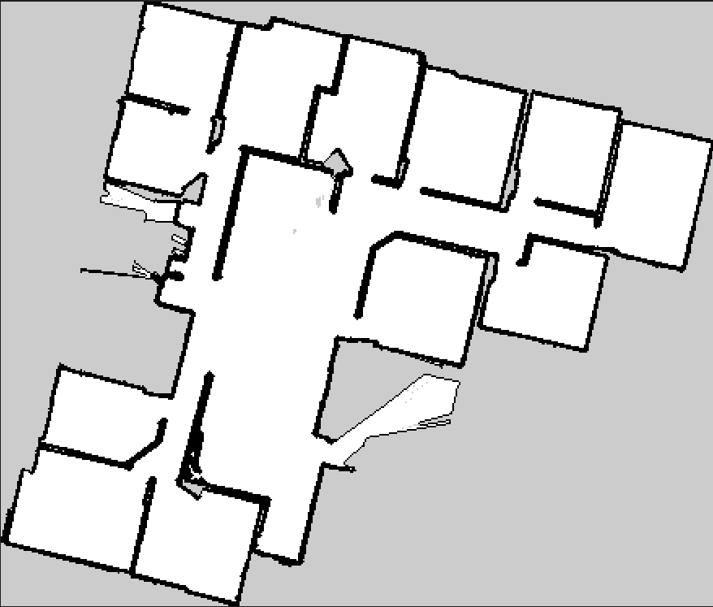
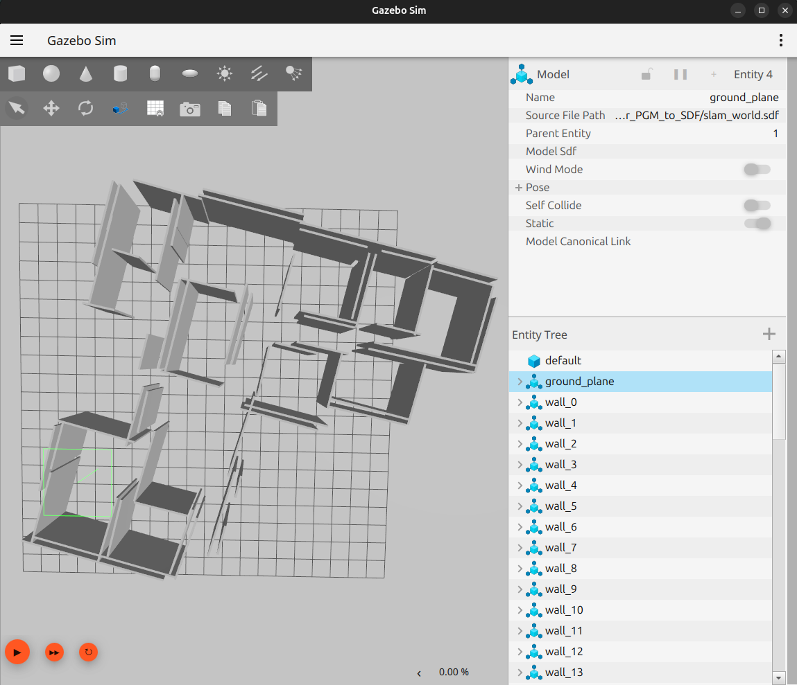

# :world_map: PGM to SDF Converter

Convert 2D SLAM maps (PGM + YAML) into 3D Gazebo worlds (SDF format) for robot simulation.

## :package: Installation

**No cloning needed!** Just download the single file:

1. Download [`pgm_to_sdf.py`](pgm_to_sdf.py)
2. Install dependencies (see below)
3. Run it!

## :rocket: Quick Start

```bash
python pgm_to_sdf.py map.pgm map.yaml
```

This creates `slam_world.sdf` ready for Gazebo.

## :clipboard: Requirements

```bash
pip install numpy PyYAML Pillow opencv-python scipy scikit-image
```

## :dart: Usage

### Basic Usage
```bash
python pgm_to_sdf.py your_map.pgm your_map.yaml
```

### Custom Options
```bash
python pgm_to_sdf.py map.pgm map.yaml -o my_world.sdf --height 3.0 --thickness 0.2 --threshold 100
```

## :gear: Parameters

| Parameter | Default | Description |
|-----------|---------|-------------|
| `--output` / `-o` | `slam_world.sdf` | Output SDF filename |
| `--height` | `2.0` | Wall height in meters |
| `--thickness` | `0.1` | Wall thickness in meters |
| `--threshold` | `128` | Pixel threshold for wall detection |
| `--sensitivity` | `1.0` | Line detection sensitivity (higher = detect more curved/short walls) |

## :wrench: How It Works

1. **Load Map** :inbox_tray: - Reads PGM image and YAML metadata
2. **Detect Lines** :mag: - Uses OpenCV Hough transform to find wall edges
3. **Scale to World** :earth_americas: - Converts pixel coordinates to real-world meters
4. **Generate Walls** :bricks: - Creates 3D wall boxes from detected lines
5. **Export SDF** :outbox_tray: - Outputs Gazebo-compatible world file

## :camera: Example: Input vs Output

| Input (2D SLAM Map) | Output (3D Gazebo World) |
|---------------------|--------------------------|
|  |  |

**Input YAML metadata:**
```yaml
image: map_3.pgm
mode: trinary
resolution: 0.05
origin: [-8.29, -8.64, 0]
negate: 0
occupied_thresh: 0.65
free_thresh: 0.25
```

## :file_folder: File Structure

Your map files should look like:
- `map_3.pgm` - Grayscale occupancy grid (black = walls, white = free space)
- `map_3.yaml` - Metadata with resolution, origin, and other parameters

## :video_game: Using in Gazebo

```bash
gz sim slam_world.sdf
```

The generated world includes:
- :sunrise: Proper lighting
- :office: 3D walls from your 2D map  
- :earth_americas: Ground plane
- :zap: Physics simulation ready